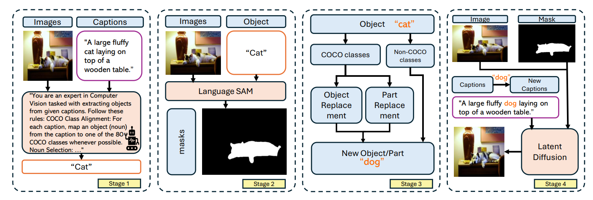
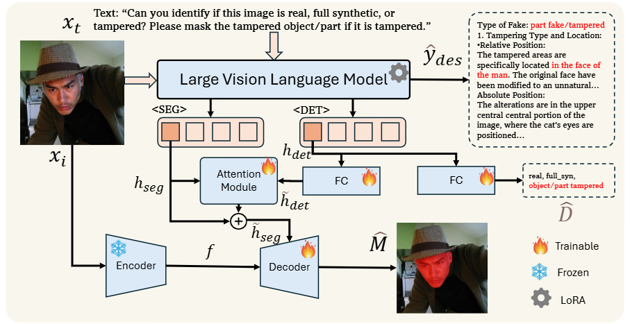
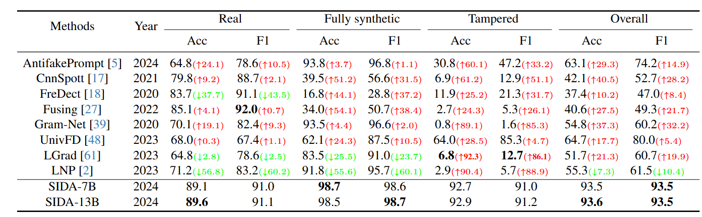
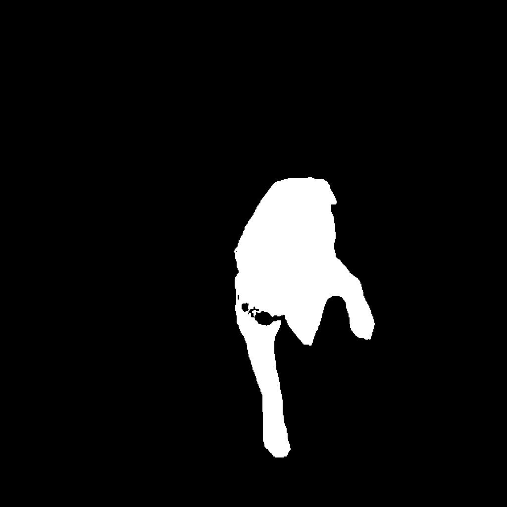
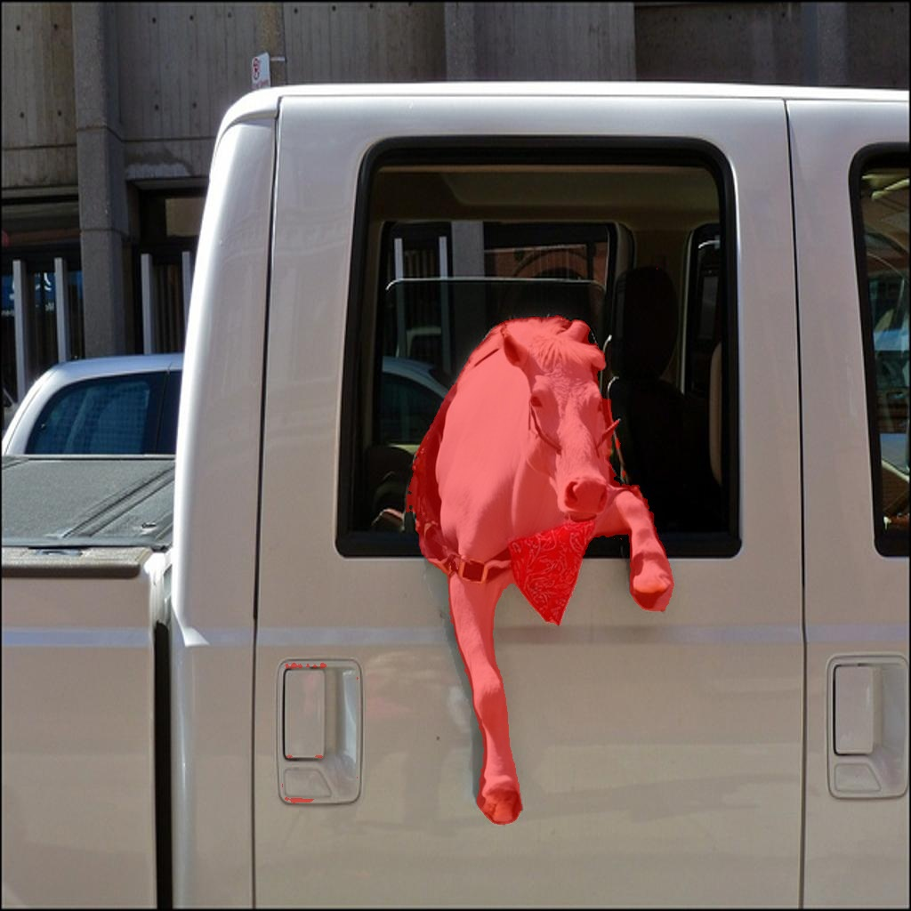
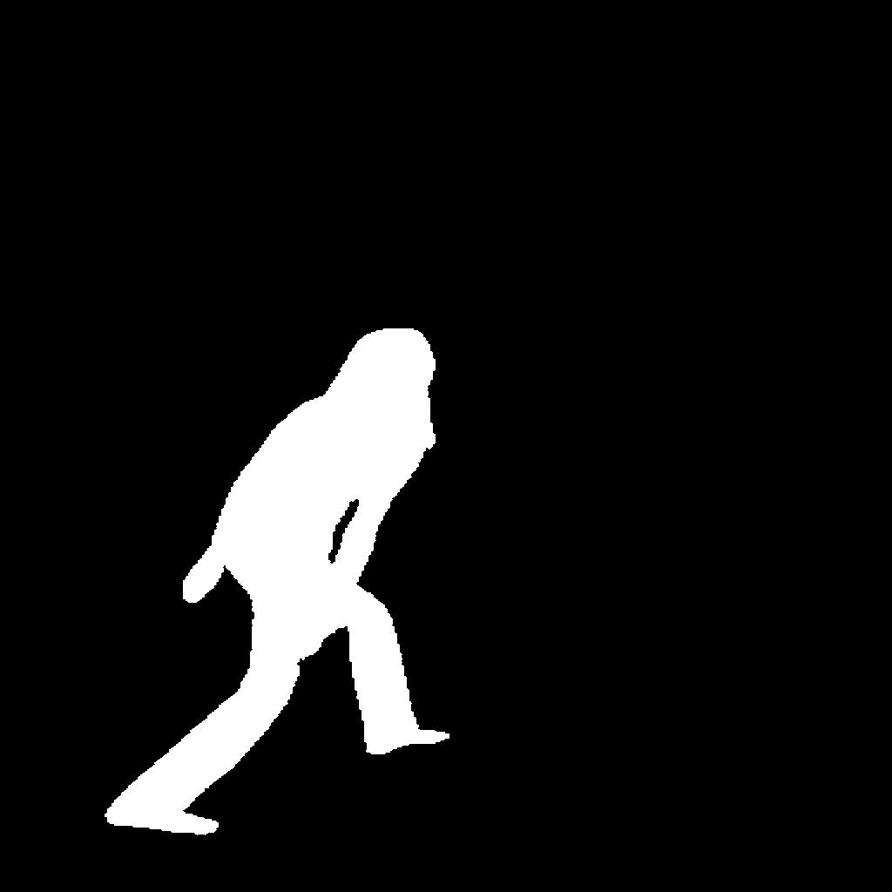
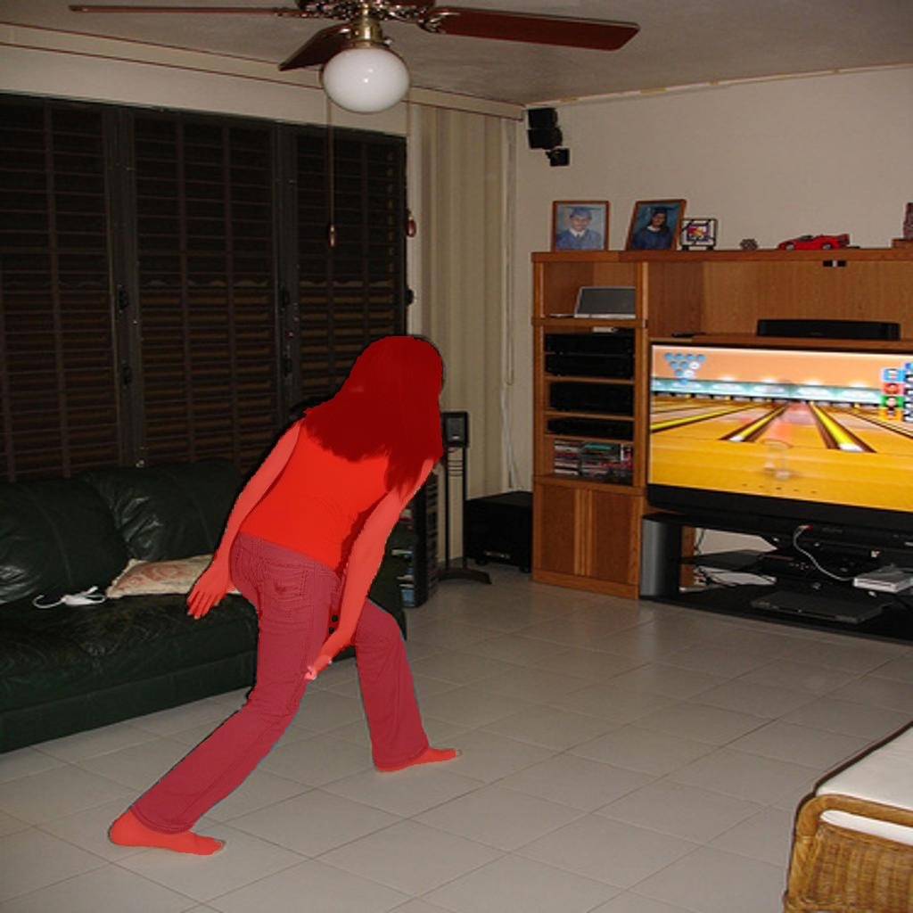
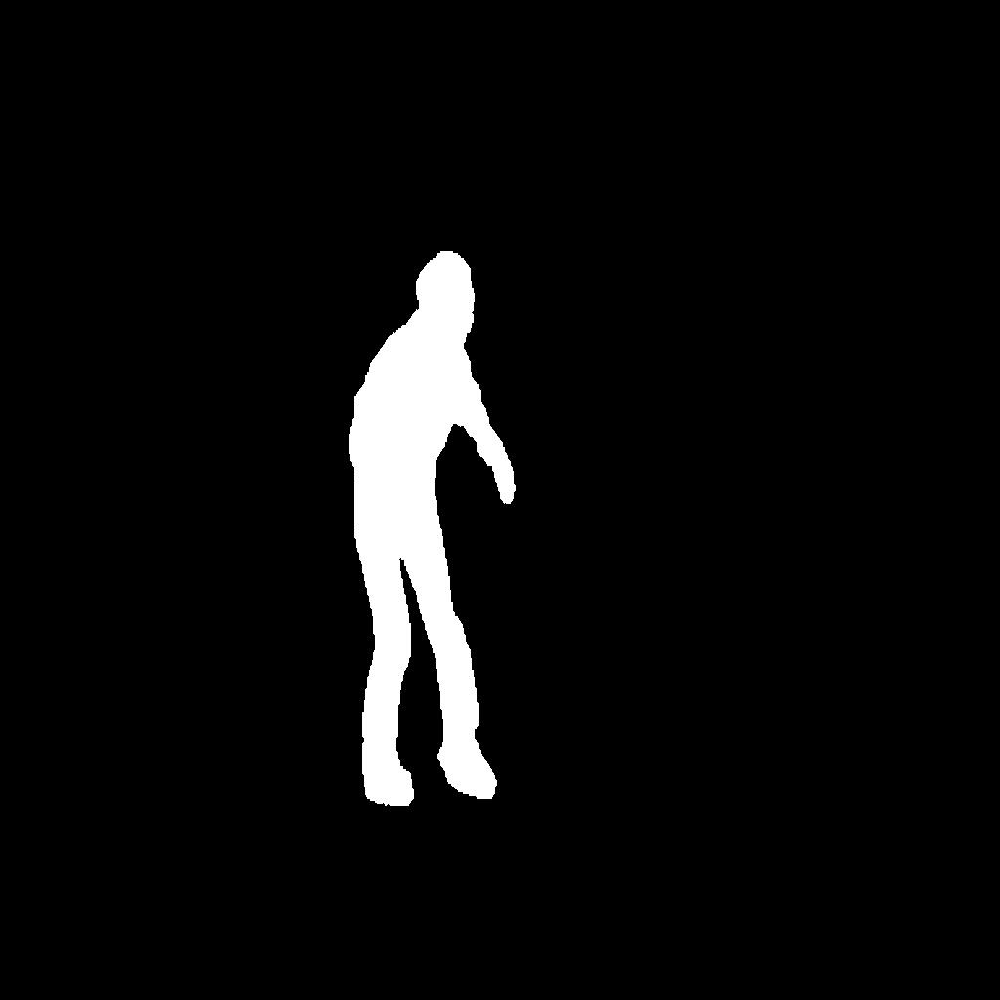
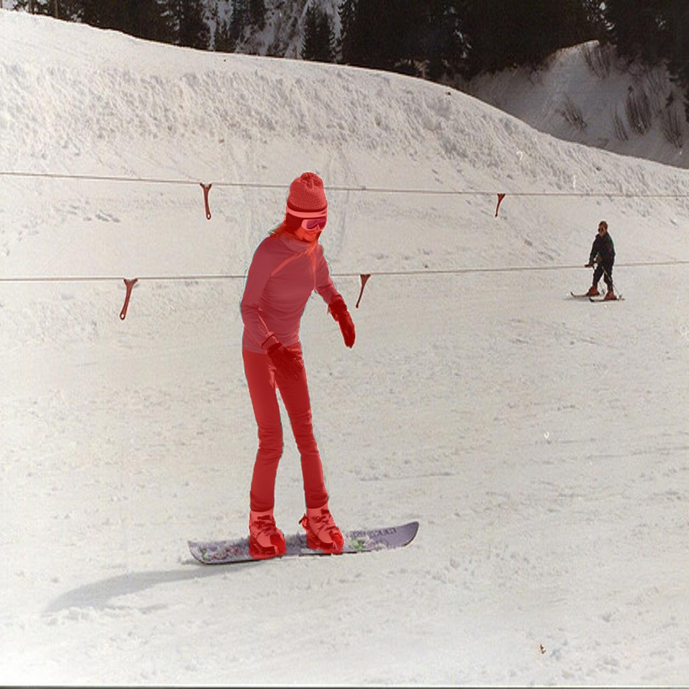

<div align="center">

<h3> SIDA: Social Media Image Deepfake Detection, Localization and Explanation with Large Multimodal Model </h3>

  <p align="center">
    <a href='https://arxiv.org/pdf/2412.04292'>
       </a>
    <a href='https://hzlsaber.github.io/projects/SIDA/' style='padding-left: 0.5rem;'>
       </a>
    <a href='https://huggingface.co/saberzl/SIDA-13B' style='padding-left: 0.5rem;'>
       </a>
    <a href='https://huggingface.co/datasets/saberzl/SID_Set' style='padding-left: 0.5rem;'>
      
    <a href='https://www.youtube.com/watch?v=oAc9BxOoDe8&t=2s' style='padding-left: 0.5rem;'>
       </a>
  </p>
</div>


[Zhenglin Huang](https://scholar.google.com/citations?user=30SRxRAAAAAJ&hl=en&oi=ao), [Jinwei Hu](https://orcid.org/0009-0008-5261-211X), [Xiangtai Li](https://lxtgh.github.io/), [Yiwei He](https://orcid.org/0000-0003-0717-8517), [Xingyu Zhao](https://www.xzhao.me/supervision-teaching)
[Bei Peng](https://beipeng.github.io/), [Baoyuan Wu](https://sites.google.com/site/baoyuanwu2015/home), [Xiaowei Huang](https://cgi.csc.liv.ac.uk/~xiaowei/), [Guangliang Cheng](https://sites.google.com/view/guangliangcheng/homepage)


## Abstract
The rapid advancement of generative models in creating highly realistic images poses substantial risks for misinformation dissemination. For instance, a synthetic image, when shared on social media, can mislead extensive audiences and erode trust in digital content, resulting in severe repercussions.
Despite some progress, academia has not yet created a large and diversified deepfake detection dataset for social media, nor has it devised an effective solution to address this issue. In this paper, we introduce the **Social media Image Detection dataSet (SID-Set)**, which offers three key advantages:
1. **Extensive volume**: Featuring 300K AI-generated/tampered and authentic images with comprehensive annotations.
2. **Broad diversity**: Encompassing fully synthetic and tampered images across various classes.
3. **Elevated realism**: Including images that are predominantly indistinguishable from genuine ones through mere visual inspection.

Furthermore, leveraging the exceptional capabilities of large multimodal models, we propose a new image deepfake detection, localization, and explanation framework, named **SIDA (Social media Image Detection, localization, and explanation Assistant)**. SIDA not only discerns the authenticity of images but also delineates tampered regions through mask prediction and provides textual explanations of the model’s judgment criteria.
Compared with state-of-the-art deepfake detection models on SID-Set and other benchmarks, extensive experiments demonstrate that SIDA achieves superior performance.

## News
- 🔥 The code and dataset are coming soon
- 🔥 (26-02-2025) SIDA has been accepted by CVPR2025! The code and dataset will be released recently.
- 🔥 (16-03-2025) Code release. 
- 🔥 (20-03-2025) Code, datasets, and models updated.
- 🔥 (10-07-2025) Code updated for multi-GPUs training problems. 
## Methods

<div align="center">
  <figcaption><strong>Figure 1: Generation Process</strong></figcaption>
  
</div>

<div align="center">
  <figcaption><strong>Figure 2: Model Pipeline Overview</strong></figcaption>
  
</div>

## Experiment

<p align="center">  </p>

## Installation

```
pip install -r requirements.txt
```

## Dataset Access

We provide two methods to access the **SID_Set dataset**:

1. Public Access via Hugging Face
The full training set and validation set are publicly available on [Hugging Face](https://huggingface.co/datasets/saberzl/SID_Set). To load SID_Set, follow the instructions in the [Hugging Face Datasets documentation](https://huggingface.co/docs/datasets/index). You can also explore visual examples directly through the dataset viewer on the platform.

2. Download from Google Drive
Alternatively, you can download the train.zip and validation.zip files for SID_Set from [Google Drive](https://drive.google.com/drive/folders/1sFZxSrDibjpvzTrHeNVS1fTf-qIue744?usp=drive_link). Due to size limitations, we’ve split the train_full_synthetic set into two parts. After downloading, please place both parts in a train/ directory.

For the test set, we provide only a single test.zip file to minimize the risk of data contamination (e.g., from foundation models crawling the test set for training). You can download it [here](https://drive.google.com/file/d/1_ivsEV5e14efuv93tJgXjWOondYnEC2G/view?usp=sharing).

For **SID_Set_description dataset**:

1. You can download the `text_label_images.zip`  for SID_Set_description from [Google Drive](https://drive.google.com/file/d/1tGIe1mWvdRFRqBeY4vADY3y90Y-kJEGZ/view).

2. You can download SID_Set_description from [Hugging Face](https://huggingface.co/datasets/saberzl/SID_Set_description).
## Training
### Training data
To train SIDA, we use the SID_Set dataset. For access to SID_Set, please refer to the Dataset Access section. If you download SID_Set through Google Drive, please organize the files as follows:

```
├── SID_Set
│   ├── train
│   │   └──real
│   │   └──full_synthetic
│   │   └──masks
│   │   └──tampered
│   ├── validation
│   │   ├── real
│   │   ├── full_synthetic
│   │   ├── masks
│   │   └──tampered
```
Note: The existing training code is designed for downloading the SID_Set from Google Drive. If you download datasets from Hugging Face, please refer to the relevant [documentation](https://huggingface.co/docs/datasets/index) for instructions on how to use the dataset.

### Pre-trained weights
SIDA-7B is pretrained on LISA-7B-v1, while SIDA-13B is pretrained on LISA-13B-llama2-v1. To download the corresponding model weights, please refer to the [LISA repository](https://github.com/dvlab-research/LISA). After downloading, place the model weights in the ```/ck``` directory.

SIDA-7B-description and SIDA-13B-description are fine-tuned versions of SIDA, enhanced with descriptions generated by GPT-4o.

You can download all SIDA versions from the following links:

[SIDA-7B](https://huggingface.co/saberzl/SIDA-7B)

[SIDA-13B](https://huggingface.co/saberzl/SIDA-13B)

[SIDA-7B-description](https://huggingface.co/saberzl/SIDA-7B-description)

[SIDA-13B-description](https://huggingface.co/saberzl/SIDA-13B-description)

### SAM VIT-H weights
Download SAM ViT-H pre-trained weights from the [link](https://dl.fbaipublicfiles.com/segment_anything/sam_vit_h_4b8939.pth).

### Training SIDA
```
deepspeed --master_port=24999 train_SIDA.py \
  --version="/path_to/LISA-7B-v1" \
  --dataset_dir='/path_to/SID_Set' \
  --vision_pretrained="/path_to/sam_vit_h_4b8939.pth" \
  --val_dataset="/path_to/SID_Set/"\
  --batch_size=2 \
  --exp_name="SIDA-7B" \
  --epochs=10 \
  --steps_per_epoch=1000 \
  --lr=0.0001 \
```
### Merge LoRA Weight
When training is finished, to get the full model weight:
```
cd ./runs/SIDA-7B/ckpt_model && python zero_to_fp32.py . ../pytorch_model.bin
```

Merge the LoRA weights of `pytorch_model.bin`, save the resulting model into your desired path in the Hugging Face format:
```
CUDA_VISIBLE_DEVICES="" python merge_lora_weights_and_save_hf_model.py \
  --version="PATH_TO_LISA" \
  --weight="PATH_TO_pytorch_model.bin" \
  --save_path="PATH_TO_SAVED_MODEL"
```

For example:
```
CUDA_VISIBLE_DEVICES="" python3 merge_lora_weights_and_save_hf_model.py \
  --version="./ck/LISA-7B-v1" \
  --weight="./runs/SIDA-7B/pytorch_model.bin" \
  --save_path="./ck/SIDA-7B"
```

### Training SIDA_description model
You can run the `train_SIDA_description.sh` script to fine-tune SIDA-7B/13B using labeled data. Please download the 3K description dataset from the provided [link](https://drive.google.com/file/d/1tGIe1mWvdRFRqBeY4vADY3y90Y-kJEGZ/view?usp=sharing).

```
deepspeed --master_port=24999 train_SIDA_description.py \
  --version="./ck/SIDA-7B" \
  --dataset_dir='/path_to/text_label_images/' \
  --vision_pretrained="./ck/sam_vit_h_4b8939.pth" \
  --val_dataset="/path_to/text_label_images/"\
  --batch_size=2 \
  --exp_name="SIDA-7B-description" \
  --epochs=5 \
 --steps_per_epoch=100 \
```
### Validation
```
deepspeed --master_port=24999 train_SIDA.py \
  --version="PATH_TO_SIDA_HF_Model_Directory" \
  --dataset_dir='/path_to/SID_Set' \
  --vision_pretrained="/path_to/sam_vit_h_4b8939.pth" \
  --val_dataset="/path_to/SID_Set/"\
  --batch_size=2 \
  --exp_name="SIDA-7B" \
  --eval_only
```

Note: The paper's results were generated using SIDA-7B and SIDA-13B models. To reproduce the experimental results, please use these specific models.

### Test
run `test.sh` to evaluate the model on the test set.

### Inference
To chat with SIDA,  we recommend using SIDA-13B for more accurate segmentation results. To view explanation results, please use SIDA-13B-description.

```
CUDA_VISIBLE_DEVICES=0 python chat_description.py --version='./ck/SIDA-13B-description'
CUDA_VISIBLE_DEVICES=0 python chat.py --version='./ck/SIDA-13B'
```
Examples:
```
CUDA_VISIBLE_DEVICES=0 python chat.py --version='./ck/SIDA-13B'
Please input your prompt: Please answer begin with [CLS] for classification, if the image is  tampered, ouput mask the tampered region. 
Please input the image path: ./examples/figure1(figure2, figure3).png
text_output:  <s> [CLS] This image is classified as tampered. It has been altered. [SEG] A mask highlighting the tampered region is provided.
```
You should get masked image like below:

    

```
CUDA_VISIBLE_DEVICES=0 python chat_description.py --version='./ck/SIDA-13B-description'
Please input your prompt: Please answer begin with [CLS] for classification, if the image is  tampered, ouput mask the tampered region and explain why. 
Please input the image path: ./examples/figure3.png
text_output:  [CLS] The image is tampered.[SEG]
 Type: {part tampered} Areas:<tampered position> The tampered area is located on the skier's right leg, specifically around the knee and ankle, in the lower half of the image.
Tampered Content:<Types of objects or parts> The skier's right leg, specifically the knee and ankle, showing the ski and the person's clothing.
Visual Inconsistencies:<lighting> The lighting on the tampered area does not match the rest of the image, showing a different shadow or highlight.<edges> The edges around the tampered area are unnaturally sharp or blurred, indicating a composite or altered element.<resolution> The resolution of the tampered area is slightly different from the rest of the image, showing a disparity in detail.<shadows> Shadows and reflections in the tampered area do not align with the lighting on other parts of the skier [end].
```

## Proposed Changes

Based on the SIDA architecture and the requirements of a practical deepfake detection system, the following changes are proposed to improve realtime performance, robustness against adversarial manipulation, and sensitivity to low-level forensic artifacts.

### 1. Decrease in Model Weight for Realtime Integration

The original SIDA framework uses large multimodal components that provide strong detection, localization, and explanation capabilities, but their computational requirements can make realtime deployment difficult. A lightweight version, referred to here as **SIDA-Lite**, is proposed to reduce latency and memory requirements while retaining the core functionality of the system.

The proposed architectural changes are:

| Component | Original SIDA | SIDA-Lite (Proposed) | Reduction |
|---|---|---|---|
| Visual Encoder | ViT-Large (~300M parameters) | EfficientNet-B0 (~5.3M parameters) | ~50× smaller |
| LLM Backbone | LLaMA-7B (7B parameters) | TinyLlama-1.1B (1.1B parameters) | ~7× smaller |
| Hidden Dimension | 4096 | 2048 | 2× smaller |

The lightweight pipeline retains the `<DET>` and `<SEG>` tokens. The EfficientNet-B0 branch performs efficient visual feature extraction, while TinyLlama-1.1B handles multimodal token generation and explanation. A lightweight fusion module combines the visual and multimodal features before the decoder produces the localization mask.

This modification is intended to provide:

- **Lower latency:** Smaller models reduce inference time and computational overhead.
- **Edge accessibility:** The system becomes more suitable for laptops and other consumer-grade hardware.
- **Reduced memory consumption:** Fewer parameters make deployment more practical.
- **Realtime integration:** The lighter architecture can support applications where rapid feedback is required.

### 2. Adversarial Attacks for Increased Robustness

Deepfake detectors can be vulnerable to small, carefully designed perturbations that are difficult for humans to notice. Therefore, adversarial testing is proposed as a systematic method for evaluating the robustness of SIDA.

The evaluation will consider:

| Dimension | Description |
|---|---|
| Knowledge | **White-box:** attacker has access to model internals such as weights and gradients. **Black-box:** attacker relies on model queries or transferability from surrogate models. |
| Goal | **Targeted:** attempts to force a specific incorrect output. **Untargeted:** attempts to change the correct output to any incorrect output. |
| Output Type | Attacks can target classification labels, segmentation/localization masks, or textual explanations. |

The proposed implementation procedure is:

1. Acquire the original image and enable gradient tracking for the input.
2. Perform a forward pass through the model and calculate the corresponding loss.
3. Backpropagate the loss gradient with respect to the input image.
4. Generate adversarial samples using **Fast Gradient Sign Method (FGSM)** or iterative **Projected Gradient Descent (PGD)**.
5. Clip the modified pixel values and enforce a strict perturbation limit.
6. Evaluate the model on the generated adversarial samples.
7. Use the results to identify weaknesses and, where appropriate, support adversarial training for improved robustness.

The evaluation will measure whether adversarial perturbations can alter the model's classification, localization mask, or generated explanation while keeping the visual change small.

### 3. Frequency Augmentation

The proposed frequency augmentation introduces a parallel frequency-domain branch to capture forensic signals that may not be sufficiently represented by standard RGB visual features. Generative models can leave spectral artifacts, including abnormal high-frequency distributions and other frequency-domain patterns that may be difficult to identify through ordinary visual inspection.

The proposed architecture consists of:

1. **Frequency Transformation:** Convert the input image into the frequency domain using a transformation such as the Fast Fourier Transform (FFT).
2. **Frequency Encoder:** Process the frequency representation through a dedicated trainable encoder to extract spectral features.
3. **Feature Projection:** Project the frequency features into a representation compatible with the SIDA multimodal features.
4. **Detection Fusion:** Concatenate the frequency embedding with the VLM detection representation to improve real/fake classification.
5. **Segmentation Fusion:** Combine frequency features with the standard visual features before the decoder to improve the precision of tampered-region masks.
6. **Explanation:** Retain the original multimodal language pathway so that the system can continue to provide textual explanations.

The expected benefit is improved sensitivity to subtle manipulation fingerprints that may be overlooked by a purely RGB-based visual encoder.

### Proposed Architecture

The three modifications can be integrated into a single improved pipeline:

```text
                         Input Image
                             |
              +--------------+--------------+
              |                             |
       Lightweight RGB              Frequency Transform
       Visual Encoder                     (FFT)
       EfficientNet-B0                       |
              |                        Frequency Encoder
              |                             |
              +-------------+---------------+
                            |
                    Feature Fusion
                            |
                     Lightweight VLM
                    TinyLlama-1.1B
                            |
                     <DET>       <SEG>
                       |            |
                 Detection     Segmentation
                    Head           Head
                       |            |
              Real / Synthetic   Localization
                 / Tampered          Mask
                            |
                     Explanation
                            |
                 Textual Forensic
                    Explanation
```

### Expected Outcome

The proposed changes are designed to improve SIDA in three complementary dimensions:

- **Efficiency:** Model lightweighting makes the framework more suitable for realtime and resource-constrained deployment.
- **Robustness:** Adversarial evaluation exposes vulnerabilities and provides a basis for improving resistance to deliberate attacks.
- **Forensic sensitivity:** Frequency augmentation adds low-level spectral information that complements the semantic understanding of the multimodal backbone.

The existing SIDA functionality is preserved as the foundation: classification, tampered-region localization, and textual explanation. The original project describes these capabilities and the use of `<DET>` and `<SEG>` tokens for detection and segmentation. fileciteturn1file0L31-L32 fileciteturn1file0L167-L176

## Citation 

```
@inproceedings{DBLP:conf/cvpr/HuangHLH00W0C25,
  author       = {Zhenglin Huang and Jinwei Hu and Xiangtai Li and Yiwei He and Xingyu Zhao and Bei Peng and Baoyuan Wu and Xiaowei Huang and Guangliang Cheng},
  title        = {{SIDA:} Social Media Image Deepfake Detection, Localization and Explanation
                  with Large Multimodal Model},
  booktitle    = {{IEEE/CVF} Conference on Computer Vision and Pattern Recognition(CVPR) 2025},
  year         = {2025},
}
```

## Acknowledgement
This work is built upon the [LLaVA](https://github.com/haotian-liu/LLaVA) and [LISA](https://github.com/dvlab-research/LISA).  Much of the documentation in this README is adapted from LISA. We thank the authors for their innovative work!
